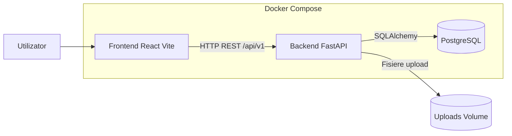

# Laborator 02 - Design arhitectura aplicatiei

## 1. Context
Aplicatia este un sistem de management al evenimentelor universitare, cu:
- Frontend web (React + Vite)
- Backend API (FastAPI)
- Baza de date PostgreSQL
- Orchestrare locala prin Docker Compose

## 2. Alternative analizate

### Varianta A - Microservicii
Exemplu de separare:
- Serviciu Auth
- Serviciu Events
- Serviciu Registrations
- Serviciu Admin/Users
- API Gateway
- Mesagerie interna

Avantaje:
- Scalare independenta pe componente
- Izolare mai buna la defecte
- Potrivita pentru echipe mari

Dezavantaje:
- Complexitate operationala ridicata
- Cost mai mare pentru observabilitate, deploy, tracing
- Overhead de comunicare intre servicii

### Varianta B - Monolit modular
Exemplu de organizare:
- Un backend FastAPI cu module pe domenii (auth, organizer, admin, public, account)
- O baza de date unica PostgreSQL
- Frontend separat ca aplicatie SPA

Avantaje:
- Implementare mai rapida pentru echipa mica/medie
- Testare si debugging mai simple
- Cost operational redus

Dezavantaje:
- Scalare mai putin granulara
- Cuplare mai mare intre module daca nu se respecta boundaries

## 3. Decizie de arhitectura
Decizia curenta: Monolit modular pentru backend, cu frontend separat.

Justificare:
- Cerintele proiectului sunt acoperite eficient cu cost redus de complexitate.
- Timpul de dezvoltare pentru laboratoare este optimizat.
- Structura pe routere si modele permite evolutie ulterioara spre microservicii daca volumul creste.

## 4. Arhitectura implementata (AS-IS)

## 5. Delimitare module backend
- auth: login/signup, Google OAuth, JWT
- public: listare si filtrare evenimente
- organizer: creare, editare, trimitere spre aprobare
- admin: aprobare/respingere evenimente, management utilizatori
- account: date profil si activitate utilizator
- export: export date/rapoarte

## 6. Directie de evolutie (TO-BE)
Daca apar cerinte de scalare avansata, prima separare recomandata:
1. Auth service
2. Event lifecycle service
3. Registration and feedback service

Acestea pot fi extrase incremental, pornind de la boundaries existente in routere si modele.
