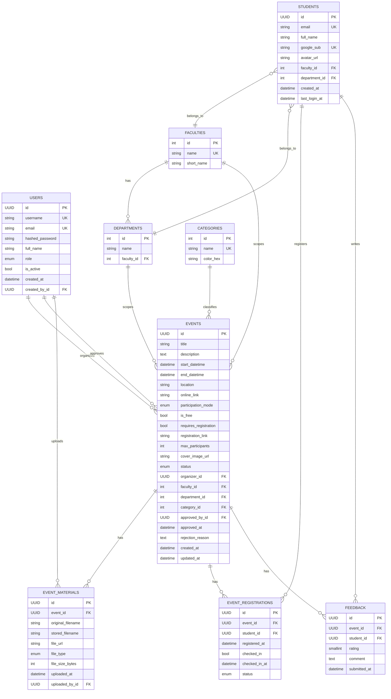

# Laborator 02 - Structura modelului de date (Diagrama ER)

Diagrama ER de mai jos este derivata din modelele SQLAlchemy existente in backend.

## Constrangeri importante
- unique users.username
- unique users.email
- unique students.email
- unique students.google_sub
- unique (event_id, student_id) in event_registrations
- unique (event_id, student_id) in feedback

## Observatii
- Modelul separa clar conturile staff (users) de conturile studenti autentificati Google (students).
- Fluxul de aprobare este explicit prin approved_by_id si approved_at in events.
- Entitatile pentru participare si feedback sunt normalizate si permit raportare ulterioara.
