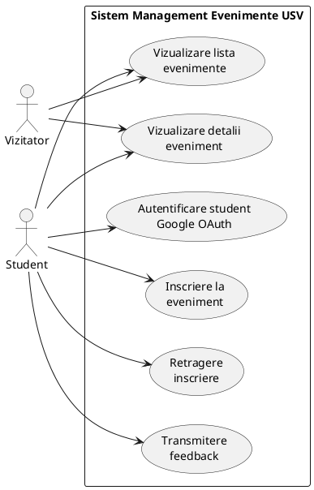
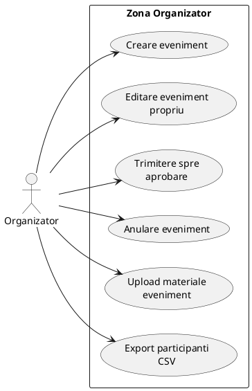
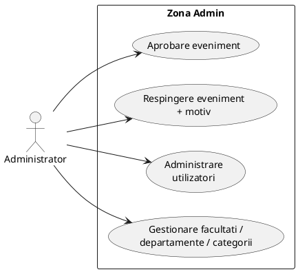
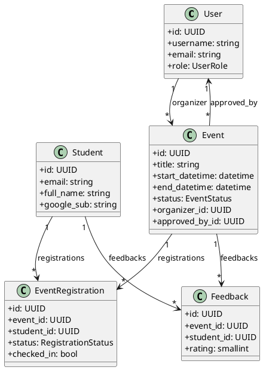
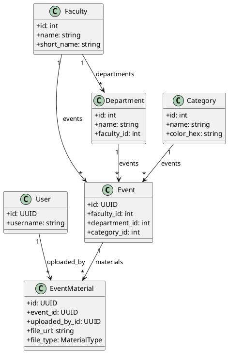
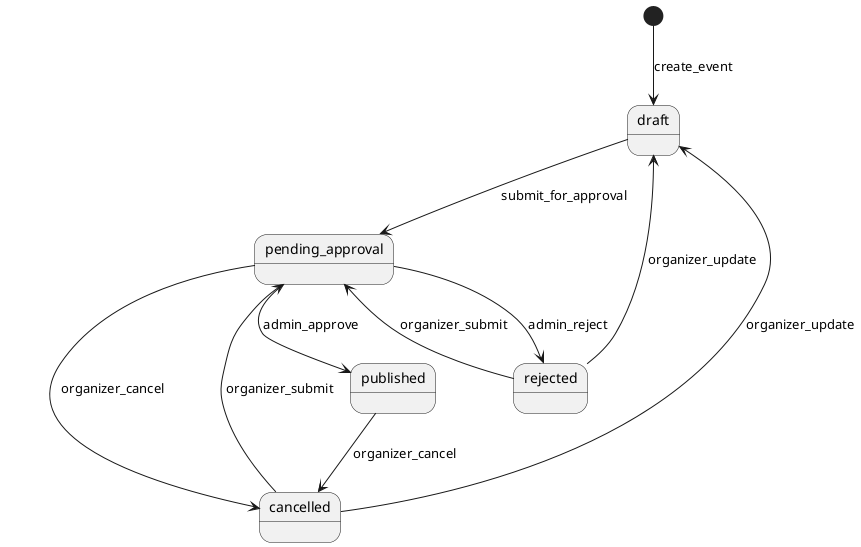
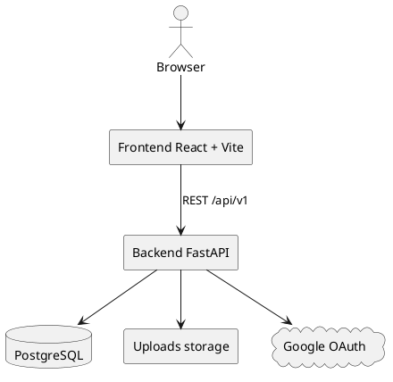
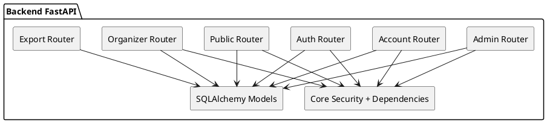

## 1. Use Case - Public + Student

## 2. Use Case - Organizator

## 3. Use Case - Administrator

## 4. Class Diagram - Entitati principale

## 5. Class Diagram - Catalog + materiale

## 6. State Diagram - lifecycle eveniment

## 7. Component Diagram - runtime

## 8. Component Diagram - backend intern

