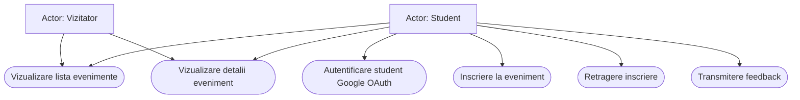
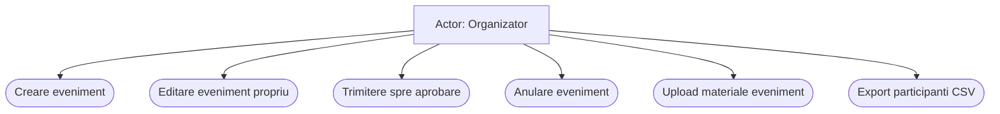
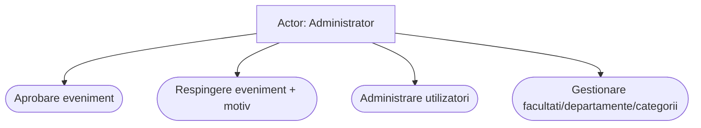
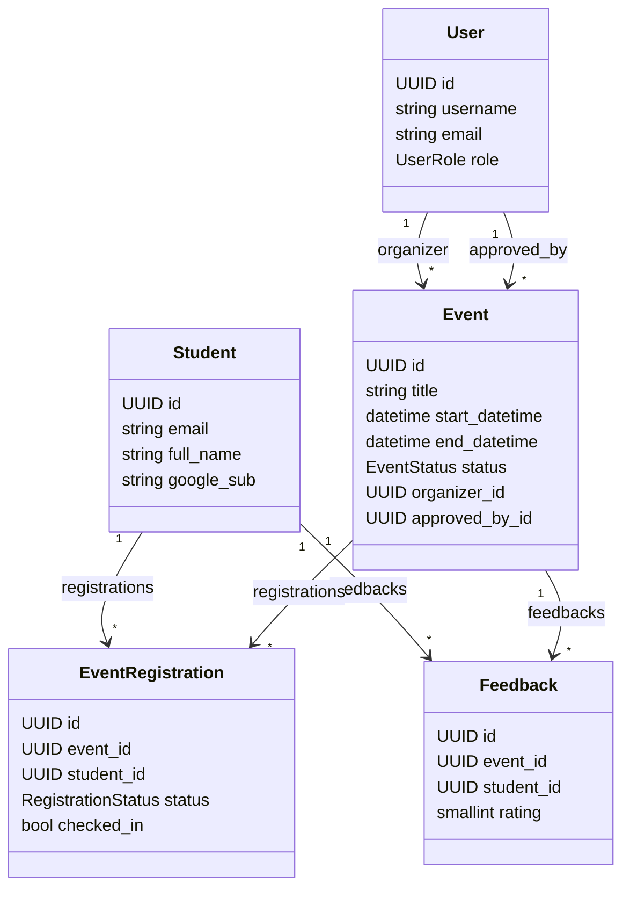
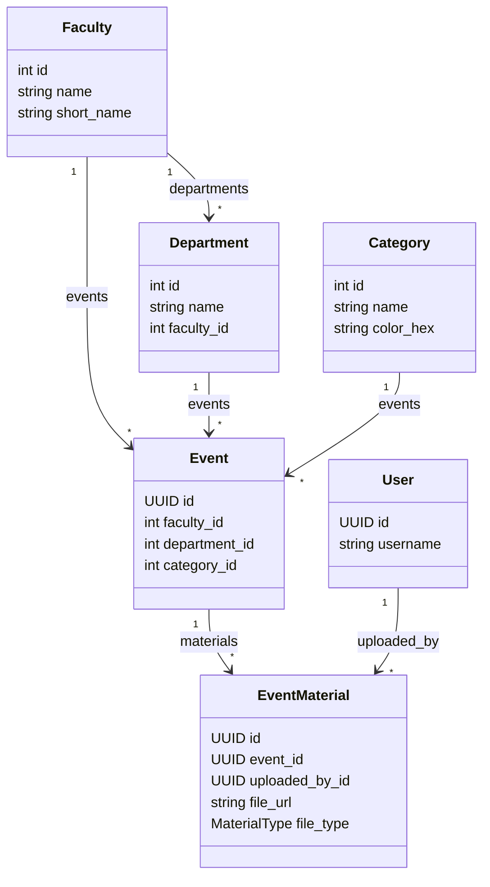
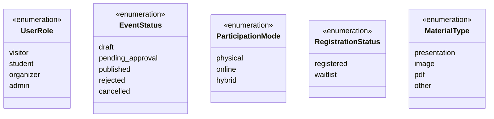
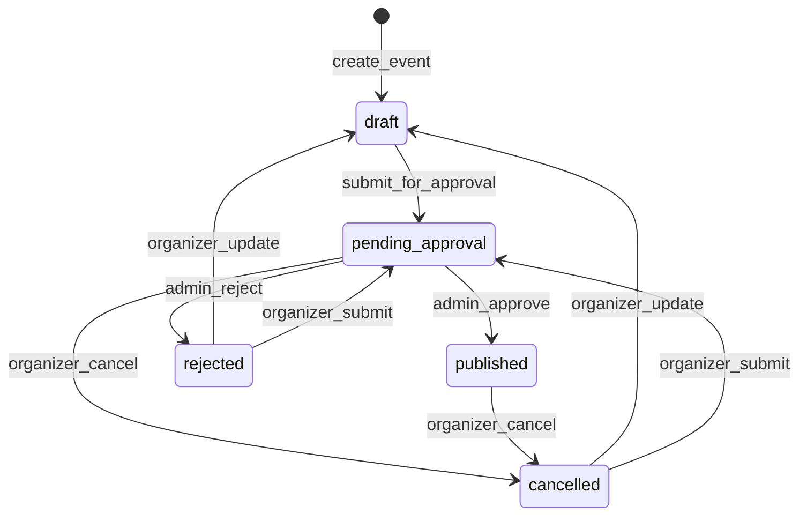
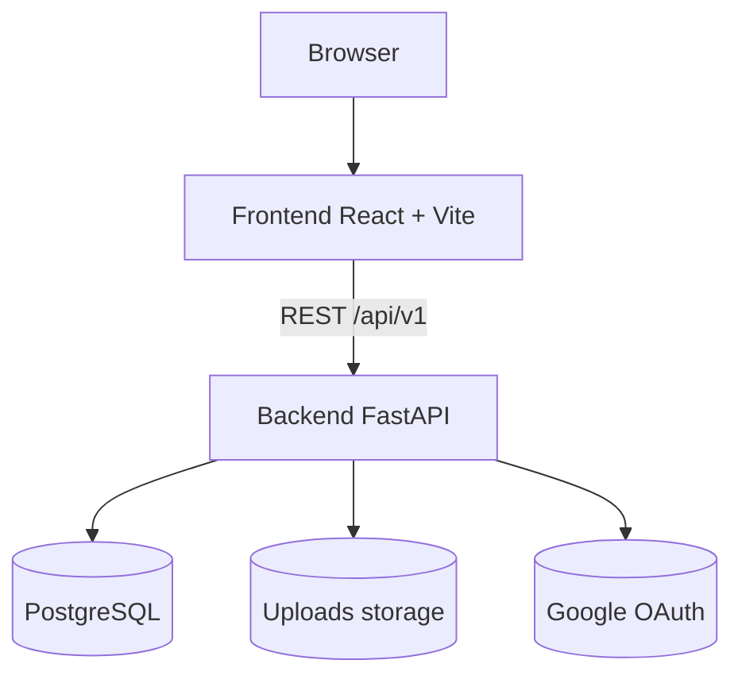
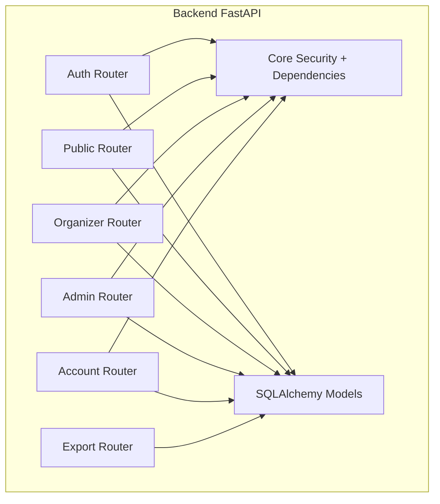

# Livrabil 1 - Diagrame UML pentru aplicatia TWAAOS

## 1. Context aplicatie

Aplicatia este un sistem de management al evenimentelor universitare cu urmatorii actori principali:

- Vizitator (neautentificat)
- Student (autentificare Google OAuth)
- Organizator
- Administrator

Arhitectura functionala este implementata in backend prin routere FastAPI:

- `auth`
- `public`
- `organizer`
- `admin`
- `account`
- `export`

Modelele de domeniu principale sunt: `User`, `Student`, `Event`, `EventRegistration`, `EventMaterial`, `Feedback`, `Faculty`, `Department`, `Category`.

## 2. Diagrama de cazuri de utilizare

### 2.1. Descriere sintetica

- Vizitatorul poate vedea evenimentele publicate si detaliile lor.
- Studentul se autentifica prin Google, se inscrie/renunta la inscriere si trimite feedback dupa incheierea evenimentului.
- Organizatorul creeaza si gestioneaza evenimentele proprii (draft, submit, edit, cancel), materiale si participanti.
- Administratorul aproba/respinge evenimente, gestioneaza utilizatorii si nomenclatoarele.

### 2.2. Cod Mermaid (Use Case) - impartit pe subiecte

#### 2.2.1 Public + Student

#### 2.2.2 Organizator

#### 2.2.3 Administrator

## 3. Diagrama de clase (model domeniu)

### 3.1. Observatii

- `Event` este entitatea centrala.
- `User` (organizer/admin) este separat de `Student` (conturi Google OAuth).
- Relatia student-eveniment este modelata prin `EventRegistration`.
- Feedback-ul este unic pe perechea `(event_id, student_id)`.

### 3.2. Cod Mermaid (Class Diagram) - impartit pe module

#### 3.2.1 Entitati principale (Event Lifecycle)

#### 3.2.2 Catalog + materiale

#### 3.2.3 Enum-uri (pentru afisare separata)

## 4. Diagrama de stari (lifecycle eveniment)

### 4.1. Reguli extrase din cod

- La creare, un eveniment are status `draft`.
- Organizatorul poate trimite la aprobare: `draft|rejected|cancelled -> pending_approval`.
- Adminul aproba: `pending_approval -> published`.
- Adminul respinge: `pending_approval -> rejected` (cu motiv).
- Organizatorul poate anula: `published|pending_approval -> cancelled`.
- Organizatorul poate edita un eveniment `rejected|cancelled`, iar sistemul il readuce in `draft`.

### 4.2. Cod Mermaid (State Diagram)

## 5. Diagrama de componente

### 5.1. Cod Mermaid (Component Diagram) - impartit pe niveluri

#### 5.1.1 Context general runtime

#### 5.1.2 Structura interna backend

